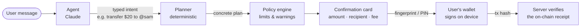

<p align="center">
  
</p>

<h1 align="center">Blocky</h1>

<p align="center">
  <b>Tell Blocky what you want to do with your money. It handles the rest.</b><br>
  An AI-powered, non-custodial money app built on Arc.
</p>

<p align="center">
  <a href="https://blocky.page">Website</a> ·
  <a href="VISION.md">Vision</a> ·
  <a href="docs/ENGINEERING.md">Engineering notes</a> ·
  <a href="PRIVACY.md">Privacy &amp; safety</a>
</p>

---

## What is Blocky?

Blocky is a money app you talk to. Instead of menus and forms, you say what you want:

> **You:** Send Sam $20<br>
> **Blocky:** Here's your send to Sam. *(shows a card: $20.00 to @sam · network fee $0.01)*<br>
> **You:** *approves with a fingerprint* — done.

Paying friends, splitting a bill, putting money aside, setting a budget, buying a stock or checking the market all go through the same conversation.

Underneath is a **non-custodial wallet on [Arc](https://www.arc.io)**, Circle's stablecoin-native chain. The user never has to think about chains, gas or bridges. They think in dollars, people and outcomes, and Blocky handles the machinery. It's a money app, not a crypto app.

## Why

Money apps keep getting more complicated, and crypto apps are worse: seed phrases, gas tokens, bridges, chain selectors. Stablecoins already make money instant, global and cheap, but the interfaces keep most people out.

Blocky's bet is that a conversation is the simplest interface there is, **if** it can be made safe. Most of this repository is about that "if".

## How it works

An AI that can move money is only acceptable if the AI can't actually move money. Blocky is built around one rule:

> **The model never produces transaction data, and never holds a key.**



1. **The agent** (Claude) understands the request and picks from a small set of **typed intents** (send, move between chains, request money…), validated against strict schemas. It can't write calldata. A malformed intent is handed back to the model, never repaired.
2. **The planner** is deterministic code that turns an intent into an exact transaction: it resolves the recipient, works out the amount, picks the route, reserves the fee and attaches warnings.
3. **The policy engine** checks the plan against the user's own limits.
4. **The user approves** a card showing exactly what leaves, to whom, and the fee in dollars, using the phone's fingerprint, face or PIN. Nothing moves without it.
5. **The device signs** with the user's embedded wallet. Blocky never holds keys.
6. **The server verifies** the result. The on-chain receipt must contain exactly the planned transfer, or nothing is recorded.

Token names, ENS records and memos are written by strangers and land in the model's context, so all of that text is fenced as untrusted data. Prompt injection was tested against a live model.

## Built on Arc

Arc is Blocky's home chain, and the reason the experience can be this simple:

- **USDC is the gas token.** A user holding only dollars pays fees from those same dollars. There's no ETH to buy, no paymaster and no sponsorship.
- **Batched, all-or-nothing transactions.** A multi-step plan (approve, then move) goes out as one transaction through Arc's Multicall3From, and it's cheaper than an ERC-4337 user operation.
- **Moving money off Arc** uses Circle's **CCTP v2** with its Forwarding Service, so the amount the user asks for is the amount that arrives on the other chain.
- Chain IDs, the USDC contract, decimals, CCTP contracts and Gateway balances were all **checked against the live network**, not only the docs. Arc's 6-vs-18-decimal USDC trap is handled in exactly one place.

Beyond Arc, Blocky can hold and move money on Ethereum, Base, Arbitrum, OP Mainnet, Polygon, Unichain, Avalanche, HyperEVM and Robinhood Chain.

## What it can do today

| | |
|---|---|
| **Pay people** | Send to a saved contact, an @username, an ENS name or an address. Request money, split bills, pay links. |
| **Save** | Savings pots, with auto-save rules (a share of what comes in, a fixed amount, or everything above a floor). |
| **Understand spending** | "How much did I spend this month?" Monthly budgets with alerts, and a weekly check-in. |
| **Invest** | Buy and sell tokenized US stocks and ETFs, and any token by contract address, with price-impact checks. |
| **Move between chains** | Bring money home to Arc or move it out, including the gas token needed on the other side. |
| **Stay informed** | Live prices, market overview, price alerts, and market news (web search is fenced: a turn that read the web can't propose a payment). |
| **Remember** | Blocky keeps short notes about preferences ("Mum is Maria"), never balances or secrets. |
| **Leave anytime** | Export the private key to another wallet, through Privy's isolated frame, so Blocky never sees it. |

## Security model

- **Non-custodial.** Keys live in the user's Privy embedded wallet. The server can plan and verify, but it can never sign or move funds.
- **Human approval for every send,** gated by the phone's screen lock (strong biometrics or the device PIN).
- **Deterministic money path.** Only the planner builds calldata, and it's hand-encoded, with no model output beyond a validated intent.
- **Server-side verification.** A plan executes at most once, and only a receipt matching it exactly is recorded.
- **Limits** per send and per day, enforced server-side. A one-tap revoke turns everything off.
- **Key export** runs in Privy's isolated iframe on the website, never in the app, behind a fresh sign-in.

Details and the reasoning behind each decision are in [docs/ENGINEERING.md](docs/ENGINEERING.md).

## Tech stack

| Layer | Technology |
|---|---|
| Mobile app | Expo (React Native), Expo Router, Reanimated |
| Wallet & auth | Privy embedded wallets, email & Google sign-in |
| Agent | Claude (Anthropic API), hand-written tool loop, prompt caching |
| Backend | Node.js, Hono, Drizzle ORM, PostgreSQL |
| Chain | viem, Arc, Circle CCTP v2 & Gateway, Across, Gas.zip |
| Shared contracts | Zod schemas for intents, plans and policy, shared by model, server and app |
| Website | Static site + Privy's web SDK for key export |
| Hosting | Railway (API, database, website), EAS (app builds) |

## Repository layout

```
packages/shared/       Zod schemas: Intent, Plan, Policy — the contract between everything
packages/agent/        The model and the boundary around it
packages/planner/      Intent in, plan out — deterministic, pure, tested offline
packages/wallet-core/  Chains, RPC, routes between chains, gas strategy
apps/api/              Hono backend: auth, planning, verification, storage
apps/mobile/           The Expo app
apps/web/              blocky.page: the website, waitlist and key export page
docs/                  Engineering notes
```

## Running it locally

Requires Node 22.13+.

```bash
npm install
cp .env.example .env                          # API config (Privy, Anthropic keys)
cp apps/mobile/.env.example apps/mobile/.env  # app config
npm run dev:api                               # http://localhost:8787
npm run dev:mobile                            # Expo
```

Without `DATABASE_URL` the API runs an embedded Postgres, so there's nothing else to install. The app needs a development build (not Expo Go) and a physical phone. Full setup is in [docs/ENGINEERING.md](docs/ENGINEERING.md#running-it).

```bash
npm run typecheck
npm test            # 700+ tests; the policy, gas and planner tests are the spec
```

## Status and roadmap

**Private beta on Android, running on Arc mainnet.** The waitlist is open at [blocky.page](https://blocky.page).

- [x] Conversational agent with typed intents, a deterministic planner and server-side verification
- [x] Sends, requests and splits, pots and auto-save, budgets and insights, price alerts
- [x] Moving money between Arc and other chains (CCTP v2), gas top-ups, tokenized stocks, tokens by address
- [x] Private key export
- [ ] iOS release
- [ ] Transaction simulation (dry runs) before signing
- [ ] On-ramp: adding money with a card or bank transfer
- [ ] Spending with a card (needs a licensed partner)

## License

Copyright © 2026 Oliver Matula. **All rights reserved.** The source is public for review and evaluation. See [LICENSE](LICENSE).

Contact: [hello@blocky.page](mailto:hello@blocky.page)
